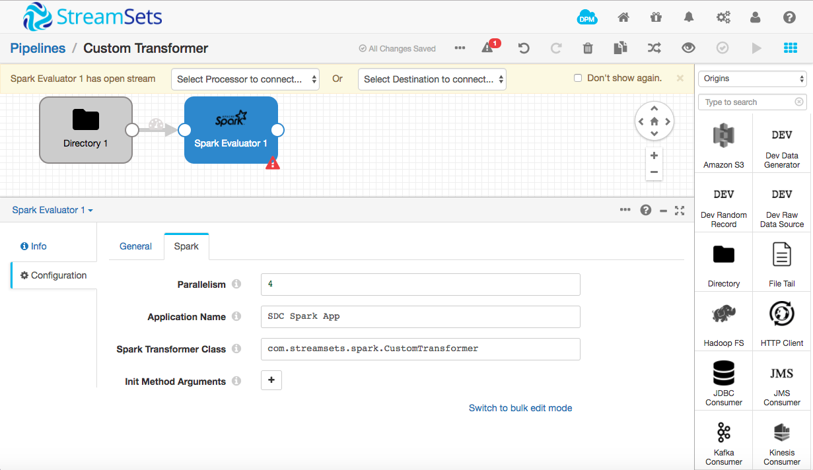
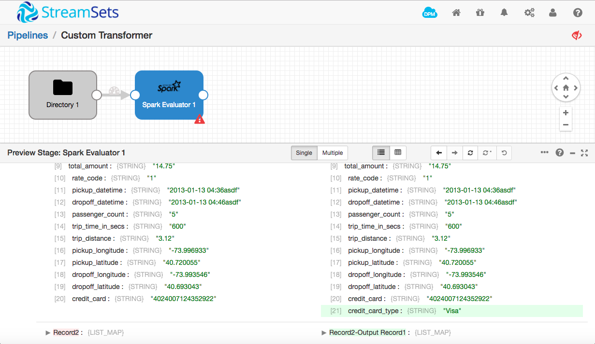
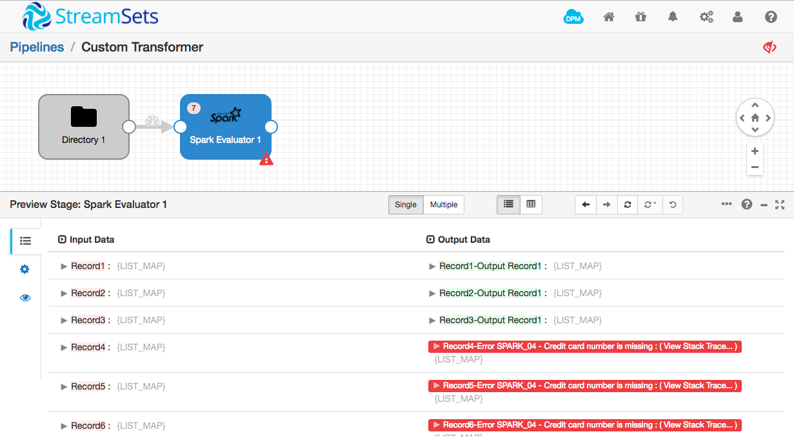
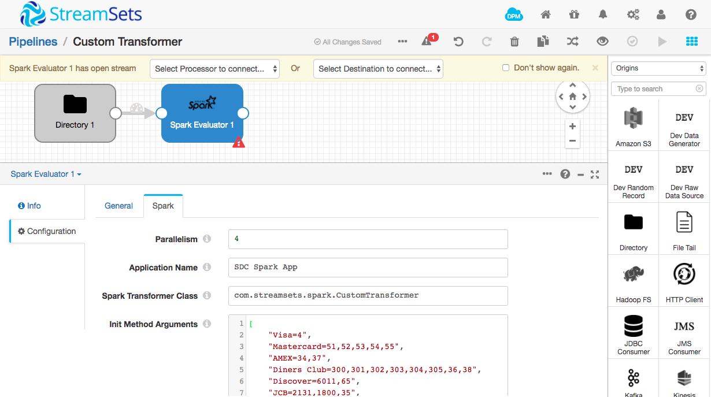
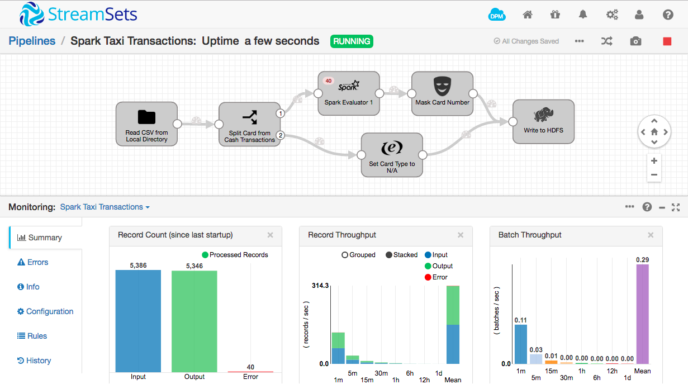

Creating a StreamSets Spark Transformer in Scala
================================================

Introduced in [StreamSets Data Collector version 2.2.0.0](https://streamsets.com/blog/announcing-data-collector-ver-2-2-0-0/), the [Spark Evaluator](https://streamsets.com/documentation/datacollector/latest/help/#Processors/Spark.html#concept_cpx_1lm_zx) stage allows you to implement custom processing in an [Apache Spark](http://spark.apache.org/) application. The Spark Application runs for the lifetime of the pipeline, processing batches of records as they arrive. You can configure the number of threads to run in the Spark Application, allowing you to take advantage of parallel processing. Your application can use the Spark libraries, manipulate data via RDDs, and call existing Scala and Java library code.

This tutorial explains how to create a simple Apache Spark application, using Scala, that will compute the type of a credit card from its number, and configure the Spark Evaluator to use it. A [companion tutorial](../tutorial-spark-transformer/readme.md) explains how to implement the same functionality in Java.

Many thanks to [Maurin Lenglart](https://twitter.com/maurinlenglart) of [Cuberon Labs](http://cuberonlabs.com/) for providing the skeleton Scala transformer.

Prerequisites
-------------

* [Download](https://streamsets.com/opensource/) and [install](https://streamsets.com/documentation/datacollector/latest/help/#Install_Config/InstallationAndConfig.html#concept_gbn_4lv_1r) StreamSets Data Collector (SDC). This tutorial uses SDC 2.2.0.0, but the instructions should apply to subsequent versions. Please [file an issue](https://github.com/streamsets/tutorials/issues/new) if this is not the case!
* [Java Development Kit](http://www.oracle.com/technetwork/java/javase/downloads/index.html) (JDK) 1.7 or later is needed to work with Scala.
* [Scala](https://www.scala-lang.org/download/) version 2.10 or later and [sbt](http://www.scala-sbt.org/download.html) version 0.13.

The stage libraries that include the Spark Evaluator also include all necessary Spark dependencies. You do *not* need to download or install a Spark distribution.

Implementing a Skeleton Transformer
-----------------------------------

The main class of the Spark Application must extend the [`com.streamsets.pipeline.spark.api.SparkTransformer`](https://github.com/streamsets/datacollector-plugin-api/blob/master/streamsets-datacollector-spark-api/src/main/java/com/streamsets/pipeline/spark/api/SparkTransformer.java) abstract class, implementing the `transform(JavaRDD<Record> recordRDD)` and, optionally, `init(JavaSparkContext context, List<String> parameters)` and `destroy()` methods.

Here's a minimal implementation that simply returns its input as its output:

    package com.streamsets.spark

    import com.streamsets.pipeline.api.Record
    import com.streamsets.pipeline.spark.api.SparkTransformer
    import com.streamsets.pipeline.spark.api.TransformResult
    import org.apache.spark.api.java.JavaPairRDD
    import org.apache.spark.api.java.JavaRDD
    import org.apache.spark.api.java.JavaSparkContext

    import java.io.Serializable
    import java.util

    class CustomTransformer extends SparkTransformer with Serializable {
      var emptyRDD: JavaRDD[(Record, String)] = _

      override def init(javaSparkContextInstance: JavaSparkContext, params: util.List[String]): Unit = {
        // Create an empty JavaPairRDD to return as 'errors'
        emptyRDD = javaSparkContextInstance.emptyRDD
      }

      override def transform(recordRDD: JavaRDD[Record]): TransformResult = {
        val rdd = recordRDD.rdd

        val errors = emptyRDD

        // Apply a function to the incoming records
        val result = rdd.map((record)=> record)

        // return result
        new TransformResult(result.toJavaRDD(), new JavaPairRDD[Record, String](errors))
      }
    }

Create a new directory for your Spark Transformer project, and save the above code there as `src/main/scala/CustomTransformer.scala`. You will also need a `build.sbt` file in the project directory itself:

    name := "spark_transformer"

    version := "1.0"

    scalaVersion := "2.10.6"

    resolvers ++= Seq(
      "cloudera" at "https://repository.cloudera.com/artifactory/cloudera-repos/"
    )

    libraryDependencies ++= Seq(
      "com.streamsets" % "streamsets-datacollector-spark-api" % "2.2.0.0",
      "org.apache.spark" % "spark-core_2.10" % "1.6.0-cdh5.9.1"
    )

Now build the project with `sbt clean package`:

    $ sbt clean package
    [info] Loading project definition from /Users/pat/Downloads/spark_transformer/project
    [info] Set current project to spark_transformer (in build file:/Users/pat/Downloads/spark_transformer/)
    [success] Total time: 1 s, completed Feb 20, 2017 10:03:48 AM
    [info] Updating {file:/Users/pat/Downloads/spark_transformer/}spark_transformer...
    [info] Resolving org.fusesource.jansi#jansi;1.4 ...
    [info] Done updating.
    [info] Compiling 1 Scala source to /Users/pat/Downloads/spark_transformer/target/scala-2.10/classes...
    [info] Packaging /Users/pat/Downloads/spark_transformer/target/scala-2.10/spark_transformer_2.10-1.0.jar ...
    [info] Done packaging.
    [success] Total time: 16 s, completed Feb 20, 2017 10:04:04 AM

You should see a jar file in the `target/scala-2.10` directory:

    $ ls target/scala-2.10
    classes       spark_transformer_2.10-1.0.jar

Installing a Spark Transformer
------------------------------

Now that you have your JAR file, you need to make it available for SDC to load. In common with third party external libraries such as JDBC drivers, Spark Transformer JAR files must be located in a directory outside the SDC deployment.

Create a directory for external library files - for example `/opt/extras` - if you have not already done so. Create a subdirectory there corresponding to the stage library you will be using. For example, if you plan to use the Spark Evaluator in the CDH 5.9 stage library, create a `streamsets-datacollector-cdh_5_9-lib` directory in `/opt/extras`. Now create a `lib` subdirectory there, so you end up with something like `/opt/extras/streamsets-datacollector-cdh_5_9-lib/lib`. Copy `spark_transformer_2.10-1.0.jar` from your project's `target/scala-2.10` directory to this `lib` directory.

If you have not already configured SDC for the external library directory, you will need to edit the `sdc-env.sh` or `sdcd-env.sh` (depending whether you are starting SDC interactively or as a service) in SDC's `libexec` directory and set the `STREAMSETS_LIBRARIES_EXTRA_DIR` environment variable, like this:

    export STREAMSETS_LIBRARIES_EXTRA_DIR="/opt/sdc-extras/"

You will also need to edit `$SDC_CONF/sdc-security.policy` and add a permission for external code:

    // user-defined external directory
    grant codebase "file:///opt/sdc-extras/-" {
      permission java.security.AllPermission;
    };

Restart SDC for the changes to take effect.

Creating a Pipeline Using a Spark Transformer
---------------------------------------------

Since the skeleton Spark Transformer simply passes records through unchanged, you could drop it into any pipeline to test it. Since we'll be extending the skeleton to operate on credit card data, we'll build a simple pipeline to read in a CSV file based on the New York City taxi transaction dataset.

1. Download the sample CSV file from [here](https://www.streamsets.com/documentation/datacollector/sample_data/tutorial/nyc_taxi_data.csv).

2. In the SDC home screen, click the **Create New Pipeline** button, enter a suitable name and description and click **Save**. 

3. In the Properties panel, click the **Error Records** tab; for the **Error Records** property, select **Write to File**.
This writes error records to a file so you can deal with error records without having to stop the pipeline.

4. Click the **Error Records - Write to File** tab and set **Directory** to an appropriate location on your machine. Note - this directory must exist for the pipeline to be started.

5. Click **Select Origin > Directory**, or, in the stage library, click the **Directory** origin to add a Directory origin to the pipeline.

6. In the Properties panel, click the **Files** tab and configure the following properties.
Use the defaults for properties that aren't listed:

  | Files Property | Value |
  | --- | --- |
  | Files Directory | Directory where you saved the sample CSV file. |
  | File Name Pattern | `nyc_taxi_data.csv` |

7. Click the **Data Format** tab and configure the following. 
Use the defaults for properties that aren't listed:

  | Data Format Property | Value |
  | --- | --- |
  | Data Format  | **Delimited** |
  | Header Line | **With Header Line** |

8. Click **Select Processor > Spark Evaluator - CDH 5.9.0**, or, in the stage library, click the **Spark Evaluator** processor, then set the stage library to **CDH 5.9.0**.

9. Click the **Spark** tab and configure the following. 
Use the defaults for properties that aren't listed:

  | Data Format Property | Value |
  | --- | --- |
  | Parallelism  | For best performance, set this to the number of CPU cores in your machine |
  | Spark Transformer Class | `com.streamsets.spark.CustomTransformer` |

Your pipeline should look like this:

Don't worry about the fact that the Spark Evaluator has an open output stream; you can still preview the pipeline interactively to check that the Spark Transformer is correctly loaded. Click the preview icon above the pipeline canvas, click **Run Preview**, and then click the Spark Evaluator stage. Open up the first record in the preview panel and you will see the unmodified data:

### Troubleshooting

    SPARK_01 - Specified class: 'com.streamsets.spark.CustomTransformer' was not found in classpath

If you see the above error message, check all the steps in [Installing a Spark Transformer](#installing-a-spark-transformer) above. If it still doesn't work, feel free to reach out for help on the [sdc-user Google Group](https://groups.google.com/a/streamsets.com/d/forum/sdc-user) or [our community Slack team](https://groups.google.com/a/streamsets.com/d/forum/sdc-user).

    SPARK_07 - Spark job failed with error: null

    java.lang.InterruptedException

If you see either of the above error messages, the most likely problem is that Spark is taking too long to start. Increase **Preview Timeout** and try again.

Extending the Spark Transformer
-------------------------------

Now that we have a very basic 'do nothing' sample working, we can extend it. We'll reimplement the Jython script from the ['Taxi Transactions' tutorial](https://streamsets.com/documentation/datacollector/2.2.0.0/help/#Tutorial/Overview.html) as a Spark Transformer in Scala. The script examines the value in the `credit_card` field and sets a `credit_card_type` field according to a set of [credit card issuer prefixes](https://en.wikipedia.org/wiki/Payment_card_number#Issuer_identification_number_.28IIN.29) - '4' for Visa, '51', '52', '53', '54' or '55' for Mastercard etc.

Let's start with a basic implementation. Add this import near the top of `CustomTransformer.scala`:

    import com.streamsets.pipeline.api.Field

Add a 'companion object' above the class definition:

    object CustomTransformer {
      val VALUE_PATH = "/credit_card"
      val RESULT_PATH = "/credit_card_type"

      // Return true if creditCard starts with one of prefixList
      def ccPrefixMatches(creditCard: String, prefixList: Array[String]) : Boolean = {
        return !(prefixList.filter(creditCard.startsWith(_)).isEmpty)
      }
    }

Then add the following code at the top of the `CustomTransformer` class, just before the `emptyRDD` member variable:

    val ccTypes = collection.immutable.ListMap(
      "Visa" -> Array("4"),
      "Mastercard" -> Array("51","52","53","54","55"),
      "AMEX" -> Array("34","37"),
      "Diners Club" -> Array("300","301","302","303","304","305","36","38"),
      "Discover" -> Array("6011","65"),
      "JCB" -> Array("2131","1800","35"),
      "Other" -> Array("")
    )

Now replace the `transform()` method with the following:

    override def transform(recordRDD: JavaRDD[Record]): TransformResult = {
      val errors = JavaPairRDD.fromJavaRDD(emptyRDD)

      // Apply a function to the incoming records
      val result: JavaRDD[Record] = recordRDD.rdd.map(record => {
        val creditCard: String = record.get(CustomTransformer.VALUE_PATH).getValueAsString
        val matches = ccTypes.filter((ccType) => CustomTransformer.ccPrefixMatches(creditCard, ccType._2))
        record.set(CustomTransformer.RESULT_PATH, Field.create(matches.head._1))
        record
      })

      // return result
      new TransformResult(result.toJavaRDD(), new JavaPairRDD[Record, String](errors))
    }

Finally, repeat the process of building the project, copying `target/scala-2.10/spark_transformer_2.10-1.0.jar` to `/opt/extras/streamsets-datacollector-cdh_5_9-lib/lib` (or the appropriate location on your machine) and restart SDC.

Preview the pipeline again and you will see that, this time, a new field has been added to each record, containing the credit card type:

Validating Input Records and Reporting Errors
---------------------------------------------

If you look at each of the first ten records, you will notice that some are cash transactions (`payment_type` is `CSH`) and do not contain credit card numbers. Since the non-existent number doesn't match any of the defined prefixes, the credit card type is set to `Other`. This isn't quite right. Let's stipulate that the transformer should only be called on records with a credit card number, and flag the record as an error if the credit card number is not present.

Add the following imports to the top of CustomTransformer.scala

    import com.streamsets.pipeline.api.Field
    import org.apache.spark.rdd.RDD

Add the following method to the CustomTransformer companion object, after the constant definitions:

    def validateRecord(record: Record) : Boolean = {
      // We need a field to operate on!
      Option(record.get(VALUE_PATH)).exists(_.getValueAsString.length > 0)
    }

Now replace the line of code that sets the `errors` value, near the top of `transform()`, with the following:

    // Validate incoming records
    val errors: RDD[(Record, String)] = rdd.mapPartitions(iterator => {
      iterator.filterNot(CustomTransformer.validateRecord(_)).map((_, "Credit card number is missing"))
    })

This code creates an RDD of records and error messages. The `validateRecord` method is called on each record and, if it returns false, the record is flagged as an error, with an appropriate message.

We'll also need to filter the invalid records out of the RDD on which transform is operating (unfortunately, there is no way of creating an RDD of errors and operating on the records in one shot). Replace these lines of code:

    val result: JavaRDD[Record] = recordRDD.rdd.map(record => {
      val creditCard: String = record.get(CustomTransformer.VALUE_PATH).getValueAsString
      val matches = ccTypes.filter((ccType) => CustomTransformer.ccPrefixMatches(creditCard, ccType._2))
      record.set(CustomTransformer.RESULT_PATH, Field.create(matches.head._1))
      record
    })

With these lines:

    val result = rdd.mapPartitions(iterator => {
      iterator.filter(CustomTransformer.validateRecord(_)).map(record => {
        val creditCard: String = record.get(CustomTransformer.VALUE_PATH).getValueAsString
        val matches = ccTypes.filter((ccType) => CustomTransformer.ccPrefixMatches(creditCard, ccType._2))
        record.set(CustomTransformer.RESULT_PATH, Field.create(matches.head._1))
        record
      })
    })

The `transform()` method should now look like this:

    override def transform(recordRDD: JavaRDD[Record]): TransformResult = {
      var rdd = recordRDD.rdd

      // Validate incoming records
      val errors: RDD[(Record, String)] = rdd.mapPartitions(iterator => {
        iterator.filterNot(CustomTransformer.validateRecord(_)).map((_, "Credit card number is missing"))
      })

      // Apply a function to the incoming records
      val result = rdd.mapPartitions(iterator => {
        iterator.filter(CustomTransformer.validateRecord(_)).map(record => {
          val creditCard: String = record.get(CustomTransformer.VALUE_PATH).getValueAsString
          val matches = ccTypes.filter((ccType) => CustomTransformer.ccPrefixMatches(creditCard, ccType._2))
          record.set(CustomTransformer.RESULT_PATH, Field.create(matches.head._1))
          record
        })
      })

      new TransformResult(result.toJavaRDD(), new JavaPairRDD[Record, String](errors))
    }

Repeat the build, copy, restart cycle, and preview the pipeline. This time, you should see 7 errors reported by the Spark Evaluator stage. Click on the Spark Evaluator and you will see the error message reported against records with missing credit card numbers:

Configuring the Spark Transformer
---------------------------------

Now that our transformer is validating its input, there's one final enhancement we can make. Right now, the mapping of credit card type to prefix is stored in the Scala code. This means that, if we want to add another prefix or type, we have to recompile the transformer jar and copy it to all SDC instances that use it. It would be much better to have the list of prefixes in the pipeline configuration.

If you look at the Spark tab for the Spark Evaluator stage, you'll see the **Init Method Arguments** property. This is a list of strings that is passed to the transformer's `init()` method when the pipeline starts. We can populate this list with our mappings, and parse it in `init()`.

Add the following import to the top of CustomTransformer.scala

    import scala.collection.JavaConversions._

Remove the definition of `ccTypes`, and the static initializer block, and replace it with the following:

    val ccTypes = collection.mutable.LinkedHashMap[String, Array[String]]()

Also remove the definition of `javaSparkContext` (we don't need it any more), and then replace `init()` with:

    override def init(javaSparkContextInstance: JavaSparkContext, params: util.List[String]): Unit = {
      for (param <- params) {
        val keyValue = param.split("=")
        ccTypes += (keyValue(0) -> (if (keyValue.size > 1) keyValue(1).split(",") else Array("")))
      }
    }

Since `ccTypes` is still a map of strings to arrays of strings, we don't need to modify the `transform()` method at all. Repeat the build, copy, restart process but, before you preview the pipeline, click the Spark Evaluator, and select the **Spark** tab in the configuration panel. Under **Init Method Arguments**, click **Switch to bulk edit mode** then paste in the following JSON:

    [
      "Visa=4",
      "Mastercard=51,52,53,54,55",
      "AMEX=34,37",
      "Diners Club=300,301,302,303,304,305,36,38",
      "Discover=6011,65",
      "JCB=2131,1800,35",
      "Other="
    ]

This is the data that will be passed to the transformer's `init()` method at pipeline startup.

Preview the pipeline and you should see that the credit card type is correctly computed, as before. Cancel the preview, click into the Spark Evaluator's Spark tab, and change `Mastercard` to `MC`. Preview again, and you should see that the credit card type for the second record is now `MC`:

Going Further
-------------

If you've done the [NYC Taxi Transactions tutorial](https://streamsets.com/documentation/datacollector/latest/help/#Tutorial/Overview.html) in the SDC documentation, you might have realized that this transformer is a drop-in replacement for the Jython script in that pipeline. Try duplicating that pipeline and replacing the Jython Evaluator with a Spark Evaluator, configuring it as above. Since this pipeline uses Stream Selector to split card from cash transactions, you should not see any errors when previewing the first 10 records. If you run the pipeline on the entire input data set, however, you will see that some records have the 'CRD' payment type but no credit card number. The transformer is correctly flagging erroneous records.

